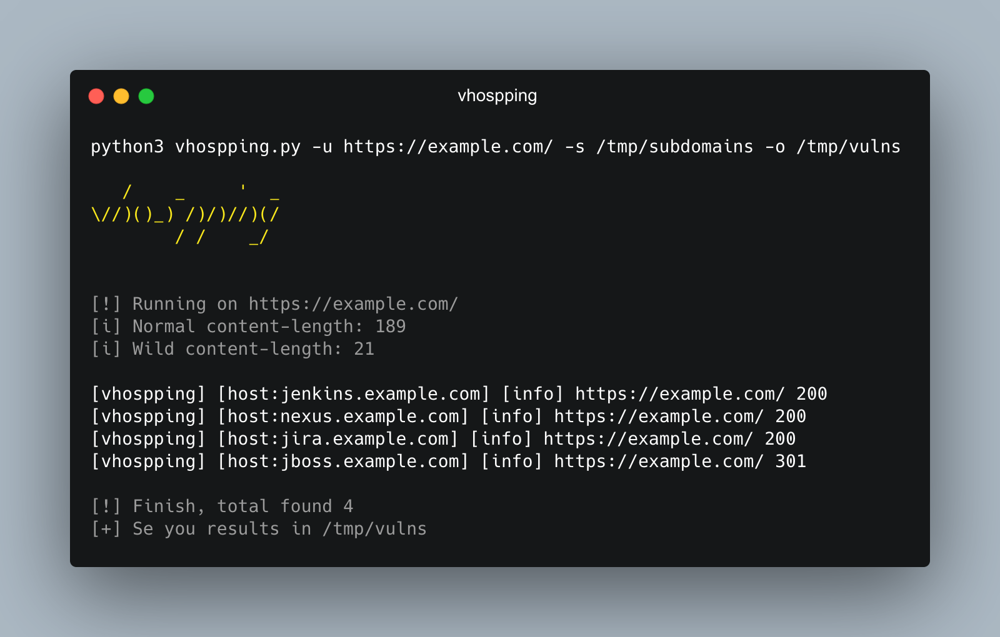

<h1 align="center">
  <br>
  <a href="#"> | Vhospping</a>
</h1>

<h4 align="center">Abuse of vhost hopping or proxy pass</h4>

---
## What is this

> Bypass access host with port filtred!

#### With Subdomains:
1- Enumerate target subdomains
2- Choose a target URL
3- Run vhospping using subdomains instead of wordlists:
```sh
▶ python3 vhospping.py -u https://example.com -s subdomains.txt -o output.txt
```

#### With Wordlist:
1- Choose a target URL
2- Run vhospping using wordlists:

```sh
▶ python3 vhospping.py -u https://example.com -w db/wordlist.txt -o output.txt
``` 
## How it works

<h3 align="center">
  </a>
</h3>

## Install
```sh
▶ git clone https://github.com/phor3nsic/vhospping.git
```
### Help

```sh
▶ python3 vhospping.py -h

usage: vhospping.py [-h] [-u URL] [-uL URLLIST] [-d DOMAIN] [-w WORDLIST] [-s SUBDOMAINSLIST] [-p PROXY] -o OUTPUT

optional arguments:
  -h, --help            show this help message and exit
  -u URL, --url URL     Url
  -uL URLLIST, --urlList URLLIST
                        Url list mode
  -d DOMAIN, --domain DOMAIN
                        Force domain for header
  -w WORDLIST, --wordlist WORDLIST
                        Wordlist for hosts
  -s SUBDOMAINSLIST, --subdomainsList SUBDOMAINSLIST
                        Use subdomains for brute force
  -p PROXY, --proxy PROXY
                        Proxy url for debug Ex: http://127.0.0.1:8080
  -o OUTPUT, --output OUTPUT
                        Output for save
``` 

### More

> https://mobile.twitter.com/Bugcrowd/status/1372034980164014082/photo/1

## Tags
`fuzz` `proxy_pass` `vhost hopping`